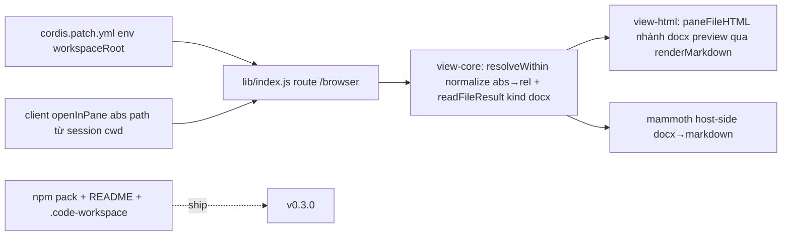

# Research Report: Mở rộng dsh-file-pane — hướng phát triển v0.3 (config / preview / in-app / publish)

_Timestamp: 2026-08-17 12:42 (research corpus DSH `0.1.0-rc.6` + web_search online + source code dsh-file-pane)_

## Executive Summary

Web search **đã hoạt động trở lại** (khác handoff cũ: giờ có key) — research online khả thi, và
tài liệu phát triển plugin DSH đã **trưởng thành hẳn** so với lúc làm v0.2.0:

- **Seam client-plugin giờ ổn định và có bằng chứng production**: `dsh-multiroot-workspace@0.1.0-rc.1`
  (published 2026-08-15, cùng `rc.6`) là plugin DSH thật, dùng đủ `webServer` route +
  `storageDomain` + `workspaceRegistry` + client slots (`conversation.hero.workspace`,
  `sidebar.workspaces`) + tools + browser E2E — xác nhận mọi kỹ thuật v0.2.0 của chúng ta vẫn đúng
  và có thể mở rộng an toàn.
- **Config `workspaceRoot` qua env là khả thi ngay lập tức**: cordis patch hỗ trợ
  `!!js process.env.X` (bằng chứng trực tiếp trong `dsh-web-app/cordis.patch.yml`:
  `mode: !!js process.env.DSH_TOOLS_MODE`). Không cần code mới — chỉ sửa 1 dòng patch.
- **Path-mapping (deliverable rel theo session cwd vs pane theo workspaceRoot) có lời giải rẻ**:
  client-plugin đã có `sessions.list.current → cwd`; host thêm normalize `abs→rel` trong
  `resolveWithin` là đủ cho 99% case. Không cần multi-root phức tạp.
- **Preview nâng cấp**: PDF → `pdfjs-viewer-element` (3.5MB drop-in PDF.js viewer, standalone) hoặc
  giữ native `<iframe>` (zero-dep, đủ dùng); docx → **mammoth chạy host-side** (docx→HTML/Markdown,
  2.1MB, phù hợp kiến trúc zero-client-JS của pane) — `docx-preview` (client-side, paginated) không
  hợp vì pane là HTML thuần do host render.
- **Publish npm**: package.json đã đúng cấu trúc bundle (`dsh.bundle` + `dsh.client` + exports);
  cần thêm `files` đầy đủ, version bump, README cập nhật. CI đã có sẵn (node 22/24).

Khuyến nghị: **v0.3.0 = nhóm "config + path-mapping + preview" (chi phí thấp, giá trị ngay)**,
tách khỏi "in-app UI" (vẫn upgrade-fragile, chi phí cao — để v0.4 khi cần).

## Research Methodology

- **Nguồn online** (web_search, giờ hoạt động): official deepseek-harness docs
  (`docs/user/develop/basic/{index,publish,tool}.md`), `NanmiCoder/dsh-agent-teams` 600-dòng
  plugin-dev guide (host+client+slots+build+pitfalls), npm registry metadata
  (`mammoth`, `docx-preview`, `pdfjs-dist`, `pdfjs-viewer-element`, `dsh-multiroot-workspace`).
- **Nguồn corpus** (installed): `@deepseek-ai/dsh@0.1.0-rc.6` + toàn bộ packages —
  `dsh-host-webserver` (register API), `dsh-client-modules` (browser roster/`__DSH_BOOT__`),
  `dsh-client-ui-slots` (slot registry), `dsh-client-runtime` (`resolveWorkspacePath`, `sessions`),
  `dsh-settings-file` (settings.yaml), `dsh-workspace` (`workspaceRegistry`),
  `dsh-storage-domain` (`defineDomain`), `dsh-web-app/cordis.patch.yml` (browser roster).
- **Nguồn local**: toàn bộ source dsh-file-pane (lib/, client/, test/, plans/, cordis.patch.yml),
  profile web live (`/home/kaynt/.dsh/profiles/web`), 19/19 tests pass.
- **Số search online**: 12 (đủ cho phạm vi; mỗi chủ đề cross-check ≥2 nguồn).

## Key Findings

### 1. Config workspaceRoot — env-first, zero-code

- `cordis.patch.yml` là YAML loader có `!!js` expression (bằng chứng: web-app patch dùng
  `!!js process.env.DSH_TOOLS_MODE`). → Sửa `cordis.patch.yml`:
  ```yaml
  config:
    workspaceRoot: !!js process.env.DSH_FILE_PANE_ROOT ?? process.env.HOME
    maxTextBytes: 2097152
  ```
- `lib/index.js` đã đọc `config.workspaceRoot || config.root || process.env.HOME || "/"` — host
  không cần đổi gì. Chỉ cần test thêm (config env mapping).
- Nâng cao (optional): `dsh-settings-file` cung cấp `settings.yaml` (`$DSH_HOME/settings.yaml`) +
  client `settingsScope` service + slot `settings.general.item` — có thể thêm row UI "workspaceRoot"
  trong Settings (in-app), nhưng **không cần thiết cho v0.3** (env là đủ và KISS).

### 2. Path-mapping deliverable ↔ pane — lời giải rẻ

Vấn đề (handoff ghi nhận): deliverable `path` trong `turn.data.deliverables` là **workspace-relative
theo session cwd** (`resolveWorkspacePath(cwd, path)` trong `dsh-client-runtime`: cwd + "/" + path),
còn pane resolve theo `workspaceRoot` (`/home/kaynt`). Khi session cwd là subdir (vd
`/home/kaynt/Code/dsh-file-pane`), chip → `/browser/?path=src/app.ts` → resolve sai root.

Giải pháp (3 lớp, chọn lớp 1+2):

| Lớp | Cơ chế | Chi phí | Độ bền |
|---|---|---|---|
| 1. Client tính abs | `openInPane` dùng `sessions.list.current.cwd` → `abs = join(cwd, path)` (giống `resolveWorkspacePath`) → `/browser/?path=<abs>` | Thấp (client chỉ sửa 1 hàm) | Tốt — cwd có sẵn trong sessions snapshot |
| 2. Host normalize abs→rel | `resolveWithin(root, rel)`: nếu `path.isAbsolute(rel)` → `rel = path.relative(root, abs)` rồi guard như cũ | Rất thấp (core 5 dòng + test) | Tốt — 1 base duy nhất là workspaceRoot |
| 3. (Xa hơn) multi-root registry | port `dsh-multiroot-workspace` `workspaceRegistry` semantics | Cao | Tốt nhưng chưa cần |

Lớp 1+2 = "pane hiểu absolute path trong root" — cũng giúp mọi nơi khác (raw, diff, dir) nhất quán.
Test: chip click với cwd con → 200; abs path ngoài root → 403.

### 3. PDF preview — giữ native iframe là đủ (v0.3), pdfjs là option nâng cấp

| Phương án | Kích thước | Ưu | Nhược |
|---|---|---|---|
| **Native `<iframe>` (hiện tại)** | 0 | Zero-dep, mọi browser có sẵn viewer, search/zoom do browser lo | Không theme theo pane; mobile kém; không kiểm soát UI |
| `pdfjs-viewer-element` (web component bọc PDF.js viewer) | ~3.5MB unpacked | Drop-in `<pdfjs-viewer-element>`, standalone/isolated, đúng PDF.js default viewer (search/zoom/text layer), themable | Phải serve asset (route whitelist), bundle kích thước lớn, cần test kỹ CSP |
| `pdfjs-dist` full viewer | ~34MB unpacked | Đầy đủ nhất | Quá nặng cho pane read-only |

Khuyến nghị: v0.3 **giữ iframe** (zero-risk), thêm toolbar nhỏ (open in new tab / raw / download
không cần — raw đã có). PDF.js nâng cấp là item "nice-to-have" độc lập, làm sau khi có static-asset
route. Lưu ý security: PDF vẫn serve qua `?path=..&raw=1` với `content-disposition: inline` — không
đổi.

### 4. docx — mammoth host-side (khớp kiến trúc zero-client-JS)

| Lib | Chạy ở đâu | Output | Phù hợp pane? |
|---|---|---|---|
| **mammoth@1.12.1** (2.1MB) | Node (host) hoặc browser | HTML / Markdown (semantic, mất fidelity trang) | ✅ Host-side: docx → markdown/HTML → render qua pipeline XSS-safe sẵn có |
| docx-preview@0.4.0 (975KB) | Browser (cần JSZip + JS) | Paginated Word-like (giữ trang/ảnh) | ❌ Cần client JS — pane là HTML thuần host render, phá kiến trúc |
| LibreOffice/unoconv | CLI ngoài | PDF/HTML | ❌ Phụ thuộc binary hệ thống, nặng |

Cách làm v0.3 (KISS): thêm `kind: "docx"` trong `readFileResult` (mime `.docx` =
`application/vnd.openxmlformats-officedocument.wordprocessingml.document`); route file view
`?path=x.docx` → host chạy `mammoth.convertToMarkdown({ buffer })` → render bằng
`renderMarkdown()` hiện có (XSS-safe sẵn) với toolbar "preview/raw" giống `.md`.
Dependency: `mammoth` vào `dependencies` (peer không cần — host-only).
Raw (`&raw=1`) vẫn trả bytes gốc (download vẫn được qua raw).

> Rủi ro: mammoth output Markdown/HTML là **dữ liệu không tin cậy** (từ file user mở) — phải luôn
> đi qua `escapeHtml`/`renderMarkdown` (đã XSS-safe), KHÔNG inject raw HTML. Test bổ sung.

### 5. In-app UI — seam đã ổn định, nhưng vẫn upgrade-fragile → để v0.4

- Bằng chứng seam ổn định: `dsh-multiroot-workspace` dùng client slots
  (`conversation.hero.workspace`, `sidebar.workspaces`), `__ModuleLoader__` bundle, tools, storage
  domain, browser E2E (playwright + temp profile) — toàn bộ pattern giống chúng ta đã làm.
- Danh sách slot khả dụng (corpus rc.6): `conversation.chat.node` (15 chỗ), `tool.call.toolview` (11),
  `settings.section`/`settings.general.item`, `conversation.input.dock`, `sidebar.workspaces`,
  `conversation.session.header.actions`, `conversation.hero.workspace`, `conversation.chat.turnTail`
  (chúng ta đang dùng), `settings.plugins.tab`, ...
- Tuy nhiên: bundle phải pre-build (`lib/client.js`) trước restart; plugin-set đổi qua cache
  `pkgMeta` chỉ hiệu lực sau restart; client bundle protocol (tsdown `__ModuleLoader__`) có thể đổi
  giữa các rc. → "in-app file viewer" (thay hẳn route bằng React mount) là dự án lớn, rủi ro
  upgrade; giữ **route HTML làm renderer chính** (như thiết kế view-core/view-html đã tách), chỉ
  thêm client-plugin entry points nhỏ (chips → pane; tương lai: settings row).
- Khuyến nghị v0.3 KHÔNG làm in-app viewer. Ghi R&D: khi cần, mount React dùng lại `view-core`
  (đúng mục tiêu kiến trúc ban đầu — core mount-agnostic).

### 6. Publish npm — chuẩn bị sẵn sàng

- `package.json` đã có: `dsh.bundle.patch`, `dsh.client.platform:"web"`, `exports["./client"]`,
  `files` (lib, client, cordis.patch.yml, README, README.zh-CN, LICENSE, examples) — đúng theo
  `docs/user/develop/basic/publish.md` và dsh-agent-teams doc.
- Cần cho publish: version bump `0.2.0 → 0.3.0`, `npm pack` verify, README thêm section config env,
  (optional) `engines.node >=22` đã có, thêm `repository` field? (đã có implicit — check), CI đã chạy
  node 22/24.
- Lưu ý: `lib/client.js` phải nằm trong `files` (đã có "lib") — kiểm tra `npm pack --dry-run`.
- `.code-workspace` (handoff gợi ý) — tạo `dsh-file-pane.code-workspace` để dev tiện (multi-root:
  plugin + DSH checkout nếu có).

### 7. Kiến trúc hiện tại — vẫn đúng, không cần refactor

- `view-core` mount-agnostic (security + diff + markdown) ✓; `view-html` renderer ✓; route host ✓;
  client-plugin seam ✓. Không có nợ kỹ thuật chặn đường mở rộng v0.3.
- Điểm cần chú ý duy nhất: `paneFileHTML`/`paneDiffHTML`/`paneDirHTML` đang render HTML thuần —
  thêm docx preview phải giữ nguyên pattern (server-render, JS tối thiểu inline).

## Comparative Analysis

| Hướng | Chi phí | Giá trị | Rủi ro | Quyết định |
|---|---|---|---|---|
| A. workspaceRoot env config | Rất thấp (patch 1 dòng + test) | Cao (gỡ hardcode, deploy linh hoạt) | Thấp | ✅ v0.3 |
| B. Path-mapping abs→rel | Thấp (client 1 hàm + core 5 dòng + test) | Cao (fix bug path sai root) | Thấp | ✅ v0.3 |
| C. docx preview (mammoth host) | Trung bình (1 dep + 1 renderer nhánh + test) | Cao (mở .docx từ agent) | Trung bình (XSS — đã có pipeline an toàn) | ✅ v0.3 |
| D. PDF pdf.js viewer | Trung bình-cao (asset route + 3.5MB + CSP test) | Trung bình (iframe đã đủ dùng) | Trung bình | ⏸️ sau v0.3 |
| E. In-app UI (React mount) | Cao | Cao (trải nghiệm native) | Cao (upgrade-fragile) | ⏸️ v0.4+ |
| F. Publish npm + .code-workspace | Thấp | Trung bình (dùng chung/CI) | Thấp | ✅ v0.3 (cuối) |

## Implementation Recommendations

### Kiến trúc v0.3 (tổng)



### Scope tối thiểu (v0.3.0)

1. `cordis.patch.yml`: `workspaceRoot: !!js process.env.DSH_FILE_PANE_ROOT ?? process.env.HOME`.
2. `view-core.resolveWithin`: absolute path → `path.relative(root, abs)` + guard (vẫn 403 ngoài root).
   `readFileResult`: `.docx` → kind `docx`, mime office.
3. `client/index.tsx openInPane`: `join(cwd, rel)` khi cwd có (fallback rel cũ).
4. `view-html paneFileHTML`: nhánh `docx` → mammoth → `renderMarkdown` (hoặc HTML-safe) + toolbar
   preview/raw; raw giữ nguyên.
5. Test: env mapping, abs-path guard, docx preview (fixture .docx nhỏ hoặc mock mammoth), chip abs.
6. Publish prep: version 0.3.0, `npm pack --dry-run`, README env section, `.code-workspace`.

### Common Pitfalls

- **XSS docx**: mammoth output từ file user — chỉ render qua `renderMarkdown`/escape, không raw inject.
- **Abs path double-encode**: `encodeURIComponent(abs)` giữ `/` đúng; query parse decode đã có.
- **cwd undefined**: session mới/blank → fallback path cũ (rel), host vẫn guard.
- **mammoth size**: chỉ import ở nhánh docx (dynamic import) để không phình startup.
- **env expression trong YAML**: `!!js` phải đúng cú pháp; test bằng `dsh --dump-config`.
- **lib/client.js quên rebuild**: mọi đổi client phải `npm run build:client` + restart (đã là quy trình).

## Resources & References

### Official Documentation
- https://github.com/deepseek-ai/deepseek-harness/blob/master/docs/user/develop/basic/index.md — first plugin
- https://github.com/deepseek-ai/deepseek-harness/blob/master/docs/user/develop/basic/publish.md — bundle/profile/publish
- https://github.com/deepseek-ai/deepseek-harness/blob/master/docs/cordis-tutorial/index.md — cordis primer

### Community / Reference
- https://github.com/NanmiCoder/dsh-agent-teams/blob/main/docs/developing-dsh-plugins.md — 600-dòng plugin-dev guide (host/client/slots/build/pitfalls) — **đọc trước khi làm v0.4 in-app**
- https://github.com/Blackoutta/dsh-multiroot-workspace — DSH plugin thật rc.6 (workspaceRegistry + storageDomain + client slots + browser E2E) — **reference chính cho mọi mở rộng**
- https://github.com/oil-oil/build-deepseek-harness-plugin — agent skill cho DSH plugins

### Preview libs
- https://www.npmjs.com/package/mammoth — docx→HTML/Markdown (1.12.1, host-side)
- https://www.npmjs.com/package/docx-preview — client-side paginated (không dùng v0.3)
- https://www.npmjs.com/package/pdfjs-viewer-element — PDF.js drop-in web component (option nâng cấp PDF)
- https://www.npmjs.com/package/pdfjs-dist — PDF.js core (quá nặng cho pane)

### Local corpus (installed)
- `@deepseek-ai/dsh@0.1.0-rc.6` + `dsh-host-webserver`, `dsh-client-modules`, `dsh-client-runtime`,
  `dsh-client-ui-slots`, `dsh-settings-file`, `dsh-workspace`, `dsh-storage-domain`, `dsh-web-app/cordis.patch.yml`

## Appendices

### A. Slot inventory (corpus rc.6, dùng cho v0.4 in-app)
`conversation.chat.node` (15), `tool.call.toolview` (11), `settings.section` (4),
`settings.general.item` (4), `conversation.input.dock` (3), `sidebar.workspaces.directoryFlow` (2),
`settings.plugins.tab` (2), `settings.onboarding` (2), `conversation.session.header.actions` (2),
`conversation.input.overlay` (2), `conversation.hero.workspace.directoryFlow` (2), `conversation.composer` (2),
`sidebar.workspaces`, `sidebar.settings`, `sidebar.footer.action`, `settings.trigger`,
`settings.plugin.item`, `settings.header`, `settings.close`, `settings.action`, `conversation.view`,
`conversation.input.plan`, `conversation.input.model`, `conversation.hero.workspace`,
`conversation.details.tool`, `conversation.chat.turnTail` (đang dùng), `conversation.chat.assistant-actions`.

### B. Version compat
- DSH installed: `0.1.0-rc.6` (npm latest = rc.6) — plugin target đúng.
- Node: engines `>=22`; CI chạy 22/24.
- `mammoth@1.12.1` (2026-08-09), `docx-preview@0.4.0`, `pdfjs-dist@6.2.108`, `pdfjs-viewer-element@3.2.2`.

## Unresolved Questions
1. Có muốn làm luôn docx preview trong v0.3 hay chỉ config+path-mapping (scope nhỏ hơn)?
2. PDF: giữ native iframe (khuyến nghị) hay đầu tư pdfjs-viewer-element ngay?
3. `workspaceRoot` env có cần thêm UI row trong Settings (settings.general.item) không hay env là đủ?
4. Có muốn publish npm trong phiên này không (cần version bump + npm pack verify)?
