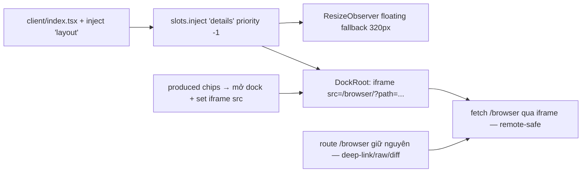

# Research Report: In-app dock cho dsh-file-pane — seam, trade-off, thiết kế

_Timestamp: 2026-08-18 10:20 · Nguồn: corpus DSH rc.6 (installed) + rc.7 (npm) + source dsh-better-sidebar-lite @7219fc8 + live system_

## Executive Summary

Mục tiêu: hiện pane **trong DSH web UI** (không rời trang) qua **slot `details`** (cột phải của
AppFrame) — pattern đã được `dsh-better-sidebar-lite` chứng minh production. Nghiên cứu xác nhận:

1. **Seam đầy đủ trong rc.6 đang chạy** — KHÔNG cần upgrade rc.7: slot `details` (`renderSlot("details")`
   trong ui-layout), `ctx.layout.openDetails()/closeDetails()`, `settingsScope` — tất cả verified.
2. **Trade-off bắt buộc**: slot `details` là **single** → winner = priority thấp nhất. ui-conversation
   đăng ký `DetailsPanel` (panel xem tool-call input/output) ở priority mặc định 0. Đăng ký priority -1
   → **shadow hoàn toàn, mất tool-details view mặc định của DSH** (better-sidebar chấp nhận điều này,
   ghi rõ trong README). Không có fallback khi render null — cột sẽ trống, không quay về DetailsPanel.
3. **Data channel**: RPC `authority: loopback` của source **chặn 403 mọi host không phải loopback** —
   không dùng được cho remote. Route HTTP `/browser` của mình **không bị trust-fence** (đã test 200
   với Host header giả `192.168.1.50` và `mybox.tailnet.ts.net`) → **dock dùng HTTP fetch là đủ cho
   local + LAN + Tailscale + Cloudflare tunnel**.
4. **Build**: source dùng esbuild + lightningcss (CSS Modules); mình giữ esbuild thuần + inline `<style>`
   trong bundle (KISS, không port CSS pipeline).
5. **Repo nguồn có release**: 4 bản beta trên GitHub + npm (`v0.0.1-beta.1` → `v0.0.2-beta.3`,
   2026-08-16/17) — target DSH **rc.7+** (settings-card seam). Repo mình chưa có release (chờ NPM_TOKEN).

Khuyến nghị: **Option A — dock chiếm slot `details` render iframe-embed route `/browser`**, data qua
HTTP fetch, floating fallback khi cột đóng. Chấp nhận mất DetailsPanel (hoặc giữ details cho DSH và
dùng shell.overlay — nhưng đó không phải "cột thật"). Chi tiết brainstorm ở report kèm theo.

## Research Methodology

- **Corpus installed (authoritative)**: `@deepseek-ai/dsh@0.1.0-rc.6` — `dsh-client-ui-layout`
  (AppFrame, DetailsColumn, renderSlot("details")), `dsh-client-ui-slots` (register/inject/priority/
  abdicate/chain), `dsh-client-ui-conversation` (DetailsPanel registration), `dsh-client-connection`
  (isLoopback, trustedHosts, isTrustedApiRequest, rpc.handle authority), `dsh-host-webserver`
  (route không có host-fence), `dsh-client-runtime` (resolveWorkspacePath).
- **npm rc.7**: tarball compare — layout/slots không đổi (chủ yếu agent-presets + cordis skills).
- **Source repo nguồn** (clone @7219fc8): `src/client/index.ts` (inject + apply), `dock/dock.tsx`
  (DockRoot, ResizeObserver, floating), `rpc-client.ts`, `host/index.ts`, `build-client-bundle.mjs`,
  docs/{architecture-brief, adr-001..004, review/findings}.
- **Live verify**: curl /browser/ với Host header giả (LAN IP, Tailscale magicDNS) → 200; gh api
  releases của repo nguồn → 4 beta.
- web_search online: 0 lần (corpus + source repo + live là đủ thẩm quyền cho chủ đề seam này).

## Key Findings

### 1. Slot `details` — cơ chế election (đã đọc source slots)

```
slots.register({name:'details', priority:-1, ...}, Dock)   ← plugin mình (shadow)
slots.register({name:'details', locale, children, store, inject, ...}, DetailsPanel)  ← ui-conversation (priority 0)
```

- `entriesOfSlot(key)`: single → 1 cell; winner = entry **priority thấp nhất, không abdicated**.
- `reportEntryError(info.abdicate)`: abdicate **chỉ khi renderer crash** (throw), không phải khi
  component render null → shadow render null = cột trống, KHÔNG fallback về DetailsPanel.
- `inject` (không phải bare `register`) → tái đăng ký sau khi declaring slot được restore (HMR-safe) —
  pattern better-sidebar dùng, mình nên dùng.

→ Hệ quả: **chiếm details = mất DetailsPanel tool-details mặc định**. Đây là quyết định phải chốt
trước khi implement (xem Brainstorm §Options).

### 2. `ctx.layout` — điều khiển cột (rc.6 verified)

```
LayoutService (ui-layout): openDetails() / closeDetails()   ← verified trong lib/client.js
DetailsColumn: giữ subtree mount ở width 0 khi đóng (không unmount — tab state sống qua collapse)
AppFrame gate: chỉ mở khi current session NON-blank + viewport đủ rộng
```

- better-sidebar theo dõi width cột bằng **ResizeObserver trên parent** (`rootRef.current.parentElement
  .parentElement`) → khi cột đóng (blank session/narrow) mà dock mở → render **floating 320px** bên
  phải thay vì biến mất; khi cột mở → dock về in-flow.
- Persist open/closed qua localStorage key.

### 3. Trust fence — quyết định data channel (live verified)

| Kênh | Loopback | LAN IP | Tailscale | Cloudflare tunnel |
|---|---|---|---|---|
| RPC `authority:'loopback'` (source) | ✅ | ❌ 403 | ❌ 403 | ❌ 403 (trừ trustedHosts) |
| HTTP route `/browser` (mình) | ✅ | ✅ 200 | ✅ 200 | ✅ 200 |

- `isTrustedApiRequest(req, trustedHosts)`: fence chỉ áp cho **/api bridge** (connection channels),
  không áp cho route webServer thường — `/browser` là prefix route thường → không fence.
- Client `connection.isLoopback` = hostname ∈ {localhost,127.x,[::1]} — chỉ phân biệt "máy DSH" vs
  "mọi nơi khác"; không phân biệt LAN/Tailscale/tunnel (cần tự so hostname nếu muốn — không bắt buộc).
- Kết luận: dock data = **HTTP fetch `/browser/...`** (một code path, chạy mọi nơi), không cần detect.

### 4. Build & test — pattern giữ KISS

- Source: `tsc` 2 program (host/client) + `build-client-bundle.mjs` (esbuild + **lightningcss** CSS
  Modules + inline @import) + copy-client-assets. Vitest jsdom cho client.
- Mình: esbuild thuần (build-client.mjs) + inline `<style>` trong component — giữ nguyên; dock không
  cần CSS Modules. Test client: giữ pattern `new Function(bundle)` + fake ctx (đã có trong
  test/client.test.mjs) — có thể thêm assert inject `layout` + render slot entry.
- Lưu ý source: **bundle-exported `inject` là nguồn thật**; `dsh.client.inject` trong package.json chỉ
  là metadata graph — mình đã làm đúng (export const inject trong client/index.tsx).

### 5. Version compat

- Installed: rc.6. Source target: rc.7+. Diff rc.6→rc.7 (npm tarball): không đổi layout/slots —
  **dock port được ngay trên rc.6**; settings-card seam (Settings > Plugins card) là điểm rc.7 mới —
  mình không cần (env đủ), nếu cần sau thì upgrade.

## Comparative Analysis

| Tiêu chí | better-sidebar (source) | dsh-file-pane (mình) | Ghi chú |
|---|---|---|---|
| Mount | slot `details` priority -1 | slot `details` priority -1 (cùng seam) | Port |
| Data | RPC loopback (chỉ local) | HTTP fetch /browser (mọi nơi) | Giữ HTTP — remote-safe |
| Tool-details mặc định | Mất (chấp nhận) | Sẽ mất nếu shadow | Trade-off phải chốt |
| Content | Explorer tree + Git tabs | File pane (dir + view + diff + preview) | Tái dùng view-core/route |
| Styling | CSS Modules + lightningcss | Inline <style> (bundle) | Giữ inline |
| Config | settings-card (rc.7+) | env + patch | Env đủ |
| Floating fallback | ResizeObserver + absolute 320px | Port | Cần |
| Toggle | Ctrl/Cmd+Shift+B + footer button | Port (optional) | Cần |

## Implementation Recommendations

### Kiến trúc đề xuất (Option A)



### Scope tối thiểu (v1 dock)
1. `client/index.tsx`: thêm `'layout'` vào `export const inject`; `apply` đăng ký
   `slots.inject('details', () => slots.register({name:'details', priority:-1, locale:NS}, DockEntry))`;
   DockEntry render `<iframe src="/browser/?path=...">` + toolbar (home/up/raw/diff) + toggle
   (layout.openDetails/closeDetails) + floating fallback.
2. Produced chips: khi remote → thay vì `location.assign` toàn trang, dispatch window event
   `dsh-file-pane:open` (path) → dock lắng nghe set iframe src + `layout.openDetails()`; fallback
   location.assign nếu dock chưa mount (blank session).
3. (Optional) Route `/browser` thêm `?embed=1` → render gọn (bỏ topbar/brand) cho iframe đẹp.
4. Test: inject layout guard (boot-fail regression), DockEntry render (fake ctx), event → src set,
   fetch URL build. Giữ 34 test cũ pass.

### Common Pitfalls
- **Quên `'layout'` trong inject** → ctx.layout undefined → dock crash (source fail-loud: throw ở
  apply). Test guard.
- **Shadow null render ≠ fallback** — nếu muốn giữ DetailsPanel, không shadow được bằng cách này.
- **iframe cùng origin CSP**: pane HTML tự render (không qua index.html) — không bị CSP shell.
- **ResizeObserver loop**: đọc width trong effect, không trong render.
- **HMR**: mọi registration trong `ctx.effect(() => {...return disposer}, 'label')` (pattern source).

## Resources & References

- Source repo: https://github.com/pixellover1433/dsh-better-sidebar-lite (releases v0.0.2-beta.3 mới nhất)
- Corpus installed: `@deepseek-ai/dsh@0.1.0-rc.6` — ui-layout, ui-slots, ui-conversation,
  client-connection, host-webserver, client-runtime
- Local: `plans/reports/260818-1005-xia-better-sidebar-compare.md` (xia), `plans/research/260817-1242-expand-research.md`
- DSH npm: `@deepseek-ai/dsh@0.1.0-rc.7` (latest) — layout/slots không đổi

## Unresolved Questions
1. **Chốt trade-off**: chấp nhận mất DetailsPanel (shadow) hay giữ details cho DSH (dùng cách khác)?
2. Có cần `?embed=1` variant gọn cho iframe không (đẹp hơn, tốn nhẹ)?
3. Toggle phím tắt (Ctrl/Cmd+Shift+B) có cần không?
4. Upgrade rc.7 có nằm trong scope không (không cần cho dock v1)?
